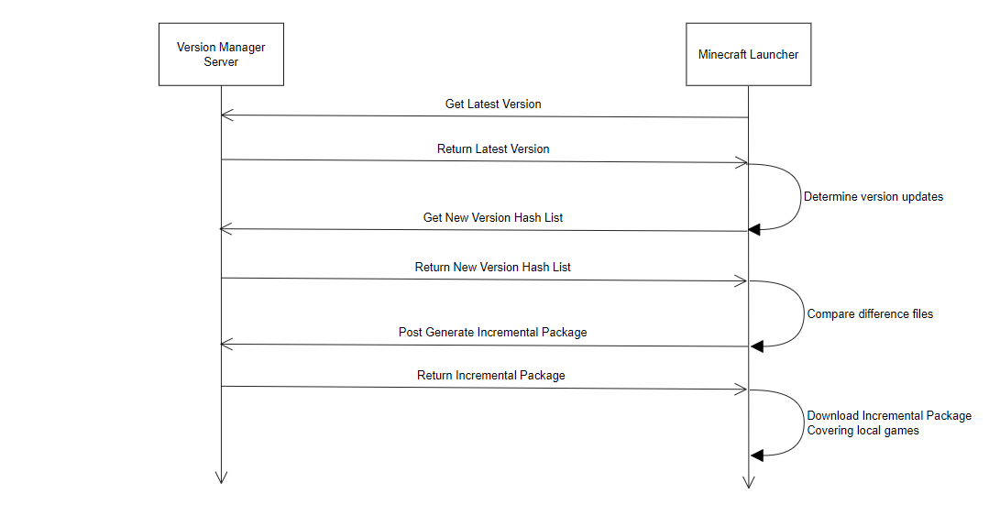

# 客户端更新通道 API

## 客户端更新流程

1. 客户端向服务器请求获取最新版本信息。
2. 服务器返回最新版本信息。
3. 客户端在本地进行版本对比，如有更新，向服务器请求获取最新版本游戏的文件哈希列表。
4. 服务器返回最新版本游戏的文件哈希列表。
5. 客户端根据文件哈希列表进行本地校验。
6. 客户端向服务器请求生成最新版本的游戏的增量包。
7. 服务器返回最新版本的游戏增量包。
8. 客户端将最新版本的游戏覆盖安装到本地。



## getLatestVersion

获取最新版本信息。

| 请求方式 | GET                           |
| -------- | ----------------------------- |
| 请求地址 | /v1/update/GetLatestVersion |

请求 header 参数：

| 参数  | 必填 | 简介     | 类型   | 示例值             |
| ----- | ---- | -------- | ------ | ------------------ |
| token | 是   | 身份验证 | Authorization Bearer Token | Bearer d4a6sda65sd1a65da4 |

返回示例：

```json
{
  "code": 0,
  "msg": "string",
  "data": {
    "latestVersion": "1.2.2",
    "description": "此版本添加了苹果皮模组，并修复了模组不兼容引起的崩溃问题。"
  }
}
```

## getLatestVersionHashList

获取最新版本游戏的文件哈希列表。

开发者需要将哈希列表数据在本地进行客户端校验。

| 请求方式 | GET                           |
| -------- | ----------------------------- |
| 请求地址 | /v1/update/GetLatestVersionHashList |

请求 header 参数：

| 参数  | 必填 | 简介     | 类型   | 示例值             |
| ----- | ---- | -------- | ------ | ------------------ |
| token | 是   | 身份验证 | Authorization Bearer Token | Bearer d4a6sda65sd1a65da4 |

返回示例：

```json
{
  "code": 0,
  "msg": "string",
  "data": {
    "hashList": "string"
  }
}
```

## generateIncrementalPackage

::: warning 注意
该 API 将在未来版本中弃用，替代 API 为 [[update#getupdatefilelist|获取更新文件列表]]，目前可以正常使用。
:::

生成增量包，请求该接口后需要等待服务器传数据，服务器会生成增量包，该操作耗时较长，客户端连接超时时间建议设置 1 分钟。

| 请求方式 | POST                             |
| -------- | ---------------------------------- |
| 请求地址 | /v1/update/GenerateIncrementalPackage |

请求 header 参数：

| 参数  | 必填 | 简介     | 类型   | 示例值             |
| ----- | ---- | -------- | ------ | ------------------ |
| token | 是   | 身份验证 | Authorization Bearer Token | Bearer d4a6sda65sd1a65da4 |

请求参数：

| 参数  | 必填 | 简介     | 类型   | 示例值             |
| ----- | ---- | -------- | ------ | ------------------ |
| data | 是   | 增量包内容 | String[] | 如下 |

请求示例：

```json
{
  "fileList": [
    ".minecraft/mods/appleskin-fabric-mc1.20.5-3.0.2.jar",
    ".minecraft/config.ini",
    "......"
  ]
}
```

返回示例：

```json
{
  "code": 0,
  "msg": "string",
  "data": {
    "packageHash": "packageHash",
  }
}
```

## getUpdateFileList

::: warning 注意
该 API 将在未来版本中启用，目前无法使用，请随时关注文档变动。
:::

获取更新文件列表。客户端计算出需要更新的文件后，将这些文件以客户端根目录开始，组合成字符串数组发送到该 API，服务端会返回每个文件的 UUID，下载请通过 [[update#download]] API 直接拼接 UUID 后，服务端会直接返回二进制文件。

值得注意的是，为防止恶意请求造成服务器损失，每个文件的下载有效期是 10 分钟，且与当前客户端 token 绑定，其他客户端用户请求会直接返回错误，每个文件的重试次数为 5 次，超过 5 次后会直接返回错误。

| 请求方式 | GET                             |
| -------- | ---------------------------------- |
| 请求地址 | /v1/update/getUpdateFileList |

请求 header 参数：

| 参数  | 必填 | 简介     | 类型   | 示例值             |
| ----- | ---- | -------- | ------ | ------------------ |
| token | 是   | 身份验证 | Authorization Bearer Token | Bearer d4a6sda65sd1a65da4 |

请求参数：

| 参数  | 必填 | 简介     | 类型   | 示例值             |
| ----- | ---- | -------- | ------ | ------------------ |
| data | 是   | 增量包内容 | String[] | 如下 |

请求示例：

```json
{
  "fileList": [
    ".minecraft/mods/appleskin-fabric-mc1.20.5-3.0.2.jar",
    ".minecraft/config.ini",
    "......"
  ]
}
```

返回示例：

```json
{
  "code": 0,
  "msg": "string",
  "data": {
    "fileList": [
      { "file": ".minecraft/mods/appleskin-fabric-mc1.20.5-3.0.2.jar", "uuid": "A4F70AF0711D44028F781F1A70D062C9" },
      { "file": ".minecraft/config.ini", "uuid": "4D90F0C7A69D41CBB5121477315A2AAD" },
      // ...
    ]
  }
}
```

## download

下载增量包，将 GenerateIncrementalPackage 返回的 packageHash 参数传入后，服务器会返回文件，客户端接收即可。

| 请求方式 | GET                             |
| -------- | ---------------------------------- |
| 请求地址 | /v1/update/download |

请求 header 参数：

| 参数  | 必填 | 简介     | 类型   | 示例值             |
| ----- | ---- | -------- | ------ | ------------------ |
| token | 是   | 身份验证 | Authorization Bearer Token | Bearer d4a6sda65sd1a65da4 |

请求参数：

| 参数  | 必填 | 简介     | 类型   | 示例值             |
| ----- | ---- | -------- | ------ | ------------------ |
| params | 是   | 文件哈希值 | String | 8DF7S9ADF87S9 |

请求示例：

```url
GET: https://example.com/api/v1/update/download?fileHash=8DF7S9ADF87S9
```

返回示例：

```json
二进制文件
```

## getWhitelist

获取白名单，每个值以换行符分割。

| 请求方式 | GET                                  |
| -------- | ------------------------------------- |
| 请求地址 | /v1/update/GetWhitelist             |

请求 header 参数：

| 参数  | 必填 | 简介     | 类型   | 示例值             |
| ----- | ---- | -------- | ------ | ------------------ |
| token | 是   | 身份验证 | Authorization Bearer Token | Bearer d4a6sda65sd1a65da4 |

返回参数：

| 参数  |  简介     | 类型   | 示例值             |
| -----  | -------- | ------ | ------------------ |
| whilelist |  白名单 | String | ...... |

返回示例：

```json
{
  "code": 0,
  "msg": "string",
  "data": {
    "whilelist": "",
  }
}
```