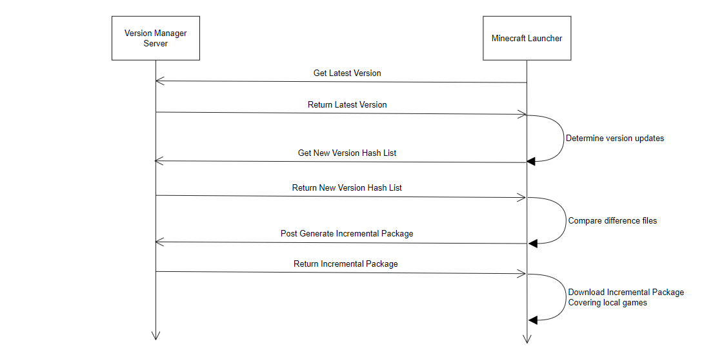

# 客户端更新通道 API

## 客户端更新流程

1. 客户端向服务器请求获取最新版本信息。
2. 服务器返回最新版本信息。
3. 客户端在本地进行版本对比，如有更新，向服务器请求获取最新版本游戏的文件哈希列表。
4. 服务器返回最新版本游戏的文件哈希列表。
5. 客户端根据文件哈希列表进行本地校验。
6. 客户端向服务器请求生成最新版本的游戏的增量包。
7. 服务器返回最新版本的游戏增量包。
8. 客户端将最新版本的游戏覆盖安装到本地。



## GetLatestVersion

获取最新版本信息。

| 请求方式 | GET                           |
| -------- | ----------------------------- |
| 请求地址 | /prod-api/v1/GetLatestVersion |

请求 header 参数：

| 参数  | 必填 | 简介     | 类型   | 示例值             |
| ----- | ---- | -------- | ------ | ------------------ |
| token | 是   | 身份验证 | Authorization Bearer Token | Bearer d4a6sda65sd1a65da4 |

返回示例：

```json
{
  "code": 0,
  "msg": "string",
  "data": {
    "latestVersion": "1.2.2",
    "description": "此版本添加了苹果皮模组，并修复了模组不兼容引起的奔溃问题。"
  }
}
```

## GetLatestVersionHashList

获取最新版本游戏的文件哈希列表。
开发者需要将哈希列表数据在本地进行客户端校验。

| 请求方式 | GET                           |
| -------- | ----------------------------- |
| 请求地址 | /prod-api/v1/GetLatestVersionHashList |

请求 header 参数：

| 参数  | 必填 | 简介     | 类型   | 示例值             |
| ----- | ---- | -------- | ------ | ------------------ |
| token | 是   | 身份验证 | Authorization Bearer Token | Bearer d4a6sda65sd1a65da4 |

返回示例：

```json
{
  "code": 0,
  "msg": "string",
  "data": {
    "hashList": "string"
  }
}
```

## GenerateIncrementalPackage

生成增量包。

| 请求方式 | POST                             |
| -------- | ---------------------------------- |
| 请求地址 | /prod-api/v1/GenerateIncrementalPackage |

请求 header 参数：

| 参数  | 必填 | 简介     | 类型   | 示例值             |
| ----- | ---- | -------- | ------ | ------------------ |
| token | 是   | 身份验证 | Authorization Bearer Token | Bearer d4a6sda65sd1a65da4 |

请求参数：

| 参数  | 必填 | 简介     | 类型   | 示例值             |
| ----- | ---- | -------- | ------ | ------------------ |
| data | 是   | 增量包内容 | json | . |

请求示例：

```json
{
  "fileList": [
    ".minecraft/mods/appleskin-fabric-mc1.20.5-3.0.2.jar",
    "launcher/config.ini",
    "......"
  ]
}
```

返回类型为增量包（zip）,可以直接覆盖至游戏根目录。

## GetWhitelist

获取白名单。

| 请求方式 | GET                                  |
| -------- | ------------------------------------- |
| 请求地址 | /prod-api/v1/GetWhitelist             |

请求 header 参数：

| 参数  | 必填 | 简介     | 类型   | 示例值             |
| ----- | ---- | -------- | ------ | ------------------ |
| token | 是   | 身份验证 | Authorization Bearer Token | Bearer d4a6sda65sd1a65da4 |

返回参数：

| 参数  |  简介     | 类型   | 示例值             |
| -----  | -------- | ------ | ------------------ |
| whilelist |  白名单 | 字符串数组 | ...... |

返回示例：

```json
{
  "code": 0,
  "msg": "string",
  "data": {
    "whilelist": "array",
  }
}
```